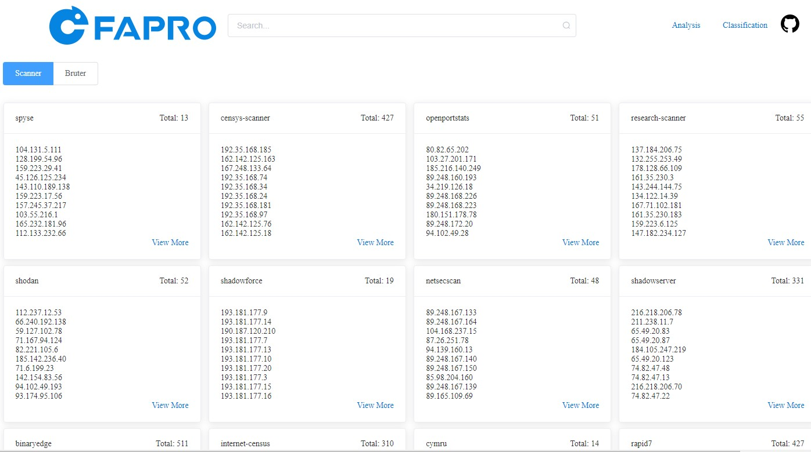
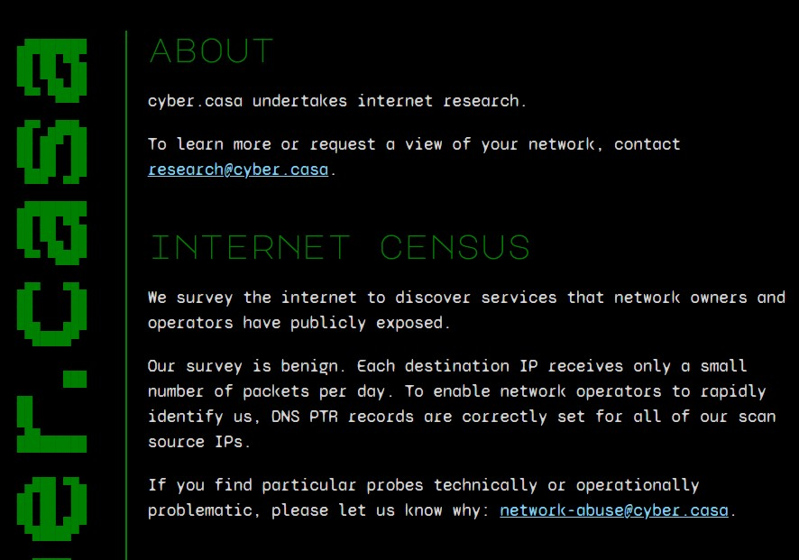

<h1 align="center">
如何打造一个网络扫描分析平台 - Part II
</h1>
<h5 align="right">如何分析扫描日志</h5>
<br/>

### [English version](howto_2.md)

## 简介
在[上一篇](howto_CN_1.md)我们介绍了如何搭建分布式网络扫描日志收集系统, 现在已经收集了大量的日志，如何从日志中获取想要的知识？还需要进一步进行分析。

还记得我们最初的目标么: 要找到是哪些ip在进行扫描？这些ip分别属于哪个组织？这些组织扫描的目的是什么？
本篇将介绍如何对收集的日志进行简单的分析，并创建规则。
    
[示例网站](https://faweb.fofa.so/)

## 规则介绍
因为FaPro收集的日志是分散的，每个ip的访问请求会分散为很多条日志，目前主要的日志种类有tcp_syn, icmp_ping, udp_packet,以及协议交互的日志。

针对单个ip的行为分析，就需要把这些分散的日志按照一定的规则进行聚合，如何定义规则？我们想看到哪些维度的数据？就需要自己去分析，这里介绍几种简单的规则。

首先根据时间段对ip的日志数据进行汇总，比如tcp_syn访问次数，访问了哪些端口; icmp_ping访问次数，udp_packet访问的端口，及每个端口对应的访问次数等，为了方便，这里统一按天进行归类。

## 编写规则
如果对elastic查询不熟悉，可以先借助kibana查询相应的图表，再使用inpect查看相应的查询语句，来获取elastic查询。

比如统计查询每个ip的icmp_ping次数，借助kibana的图表功能:


获取elastic查询语句后，把它转换为python代码:
```python 
top_ip_icmp_ping = es.search(index="fapro",
                             aggs={
                                 "ips": {
                                     "terms": {
                                         "field": "remote_ip",
                                         "order": {
                                             "_count": "desc"
                                         },
                                         "size": 10 # max aggs item
                                     }
                                 }
                             },
                             size=0,
                             query={
                                 "bool": {
                                     "filter": [
                                         {
                                             "bool": {
                                                 "should": [
                                                     {
                                                         "match_phrase": {
                                                             "message.keyword": "icmp_ping"
                                                         }
                                                     }
                                                 ],
                                                 "minimum_should_match": 1
                                             }
                                         }
                                     ]
                                 }
                             })

pprint.pprint(top_ip_icmp_ping['aggregations']['ips']['buckets'])
```

不过这个查询的是所有日期的数据，我们需要按天查询，并且对聚合结果进行分页查询，防止一次查询的数据过多，超过elastic的限制:
```python 
def all_ip_count(day, q, ip_aggs=None, page_size=1000):
    "get all ip count info by day"
    res = []
    total = get_total_ip(day)
    page = math.ceil(total / page_size)
    for i in range(page):
        aggs = {"ips": {"terms": {"field": "remote_ip",
                                  "include": {"partition": i,
                                              "num_partitions": page},
                                  "size": page_size}}}
        if ip_aggs:
            aggs['ips']['aggs'] = ip_aggs
        r = query(day, q, aggs = aggs, size=0)
        res += r['aggregations']['ips']['buckets']
    return res

## 获取2021-10-20的每个ip的icmp_ping消息计数
ping_info = all_ip_count("2021-10-20", 'message.keyword:"icmp_ping"')

## 获取2021-10-20的每个ip的tcp_syn消息计数
syn_info = all_ip_count("2021-10-20", 'message.keyword:"tcp_syn"')

local_port_agg = {"ports": {"terms": {"field": "local_port",
                                      "size": 1000}}}

## 获取2021-10-20的每个ip的tcp_syn消息的本地端口计数 (即这个ip通过tcp syn访问了本地端口多少次)
ip_port_info = all_ip_count("2021-10-20", 'message.keyword:"tcp_syn"', ip_aggs = local_port_agg, page_size = 100)

pprint.pprint(ip_port_info[0])
### 输出结果
{'doc_count': 1939, # tcp_syn消息次数
 'key': '94.232.47.190',
 'ports': {'buckets': [{'doc_count': 1937, 'key': 3389}, # 3389访问了1937次
                       {'doc_count': 2, 'key': 3390}], # 3390访问了2次
           'doc_count_error_upper_bound': 0,
           'sum_other_doc_count': 0}}
```

以94.232.47.190为例，访问了3389和3390端口,现在获取是否建立tcp连接信息:
```python 
tcp_info = query("2021-10-20", 'remote_ip:"94.232.47.190" AND message.keyword:"close conn"',
                 aggs=local_port_agg,
                 size=0)

pprint.pprint(tcp_info)
{'aggregations': {'ports': {'buckets': [{'doc_count': 1937, 'key': 3389},
                                        {'doc_count': 2, 'key': 3390}],
                            'doc_count_error_upper_bound': 0,
                            'sum_other_doc_count': 0}}}
```
可以看到，3389和3390的端口进行了tcp握手，建立了连接。

接下来，查询rdp访问使用的cookie信息，以获取更进一步的行为:
```python 
rdp_cookie_agg = {"cookies": {"terms": {"field": "cookie.keyword", "size": 100}}}
rdp_cookie_info = query("2021-10-20", 'remote_ip:"94.232.47.190" AND protocol:"rdp" AND cookie:"*"',
                        aggs=rdp_cookie_agg,
                        size=0)

pprint.pprint(rdp_cookie_info)
{'aggregations': {'cookies': {'buckets': [{'doc_count': 976,
                                           'key': 'Cookie: mstshash=Administr'},
                                          {'doc_count': 4,
                                           'key': 'Cookie: mstshash=Test'}],
                              'doc_count_error_upper_bound': 0,
                              'sum_other_doc_count': 0}}}
```

示例获取ip地址为45.146.164.110的http访问信息:
```python 
http_info_agg = {"uri": {"terms": {"field": "uri.keyword", "size": 100}},
                 "user-agent": {"terms": {"field": "headers.User-Agent.keyword", "size": 100}} }
http_info = query("2021-10-20", 'remote_ip:"45.146.164.110" AND protocol:"http" AND uri:"*"',
                        aggs=http_info_agg,
                        size=0)

pprint.pprint(http_info)
{'aggregations': {'uri': {'buckets': [{'doc_count': 63, 'key': '/'},
                                      {'doc_count': 54,
                                       'key': '/vendor/phpunit/phpunit/src/Util/PHP/eval-stdin.php'},
                                      {'doc_count': 30,
                                       'key': '/api/jsonws/invoke'},
                                      {'doc_count': 28,
                                       'key': '/Autodiscover/Autodiscover.xml'},
                                      {'doc_count': 28,
                                       'key': '/_ignition/execute-solution'},
                                      {'doc_count': 27,
                                       'key': '/?XDEBUG_SESSION_START=phpstorm'},
                                      {'doc_count': 27,
                                       'key': '/cgi-bin/.%2e/.%2e/.%2e/.%2e/bin/sh'},
                                      {'doc_count': 27, 'key': '/console/'},
                                      {'doc_count': 27,
                                       'key': '/index.php?s=/Index/\\think\\app/invokefunction&function=call_user_func_array&vars[0]=md5&vars[1][]=HelloThinkPHP21'},
                                      {'doc_count': 27,
                                       'key': '/wp-content/plugins/wp-file-manager/readme.txt'},
                                      {'doc_count': 22, 'key': '/index.php'},
                                      {'doc_count': 18,
                                       'key': '/solr/admin/info/system?wt=json'},
                                      {'doc_count': 17,
                                       'key': '/?a=fetch&content=<php>die(@md5(HelloThinkCMF))</php>'},
                                      {'doc_count': 10,
                                       'key': '/mifs/.;/services/LogService'}],
                          'doc_count_error_upper_bound': 0,
                          'sum_other_doc_count': 0},
                  'user-agent': {'buckets': [{'doc_count': 405,
                                              'key': 'Mozilla/5.0 (Windows NT '
                                                     '10.0; Win64; x64) '
                                                     'AppleWebKit/537.36 '
                                                     '(KHTML, like Gecko) '
                                                     'Chrome/78.0.3904.108 '
                                                     'Safari/537.36'}],
                                 'doc_count_error_upper_bound': 0,
                                 'sum_other_doc_count': 0}}}
```

## 展示效果

将所有这些信息收集，归类到新的分析库之后，就可以对ip信息进行更高层次的分析，比如使用faweb查看[45.146.164.110](https://faweb.fofa.so/ip_detail/?ip=45.146.164.110):


可以看到45.146.164.110访问了多个协议，而没有做端口探测，因此推测它很可能是一个协议分析工具，从端口访问记录来看，随着探测到的端口增多，协议识别访问次数也增多。 从http_url来看，它尝试识别几种web应用。

再来看一个[220.174.25.172](https://faweb.fofa.so/ip_detail/?ip=220.174.25.172):


可以看到这是一个ssh爆破工具，可以看到它关心哪些端口，以及每天尝试爆破的次数。

至此，通过使用elastic查询建立规则，并入库，就可以实现一个你自己的[greynoise](https://www.greynoise.io/viz/ip/45.146.164.110)

在[fapro analysis](https://faweb.fofa.so/analysis/)可以看到每天、每周、每月的ip数据量统计及相关的top信息。


## 更进一步
还记得我们是要对进行扫描探测的ip进行归类，下一步就是根据上面汇总的分析库，进一步使用数据分析、深度学习等方式对ip行为进行聚类，这是一项有挑战的工作，我们已经初步取得一些进展，对一些进行扫描的组织进行分类:


找到了一些不常见的组织,比如:


<h2 align="center">
<a href="https://www.recyber.net/" target="_blank">recyber</a>
</h2>


<h2 align="center">
<a href="https://cyber.casa/"" target="_blank">cyber.casa</a>
</h2>


<h2 align="center">
<a href="https://www.netsystemsresearch.com/" target="_blank">netsystemsresearch</a>
</h2>


<h2 align="center">
<a href="http://netsecscan.net/" target="_blank">netsecscan</a>
</h2>


<h2 align="center">
<a href="https://www.internet-census.org/" target="_blank">internet-census</a>
</h2>


<h2 align="center">
<a href="https://www.shadowserver.org/" target="_blank">shadowserver</a>
</h2>


<h2 align="center">
<a href="https://www.trustwave.com/" target="_blank">trustwave</a>
</h2>


<h2 align="center">
<a href="https://quintex.com/" target="_blank">quintex</a>
</h2>


接下来还有很多分析工作要做，敬请期待！


